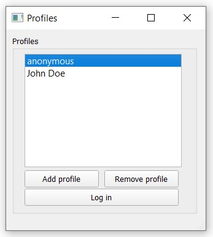
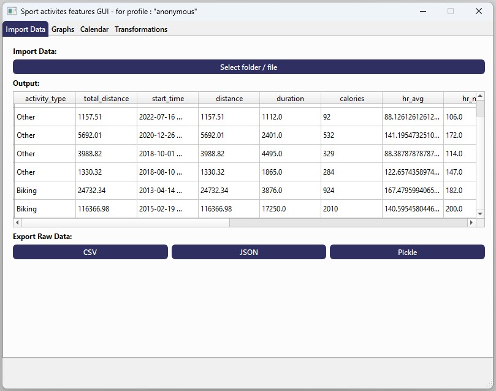
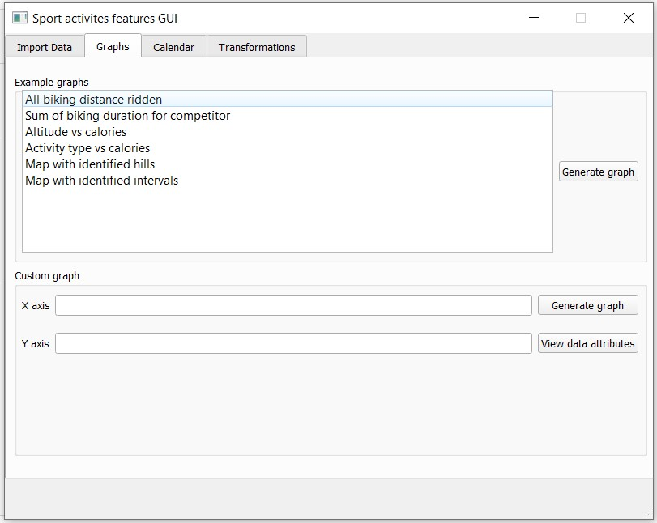
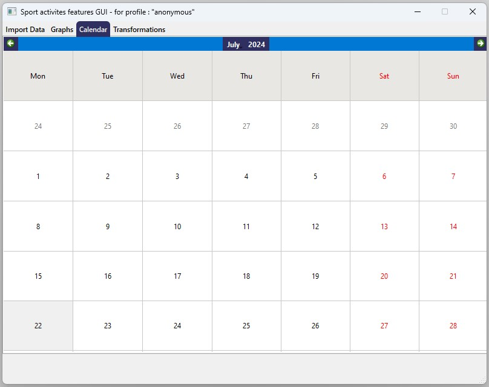
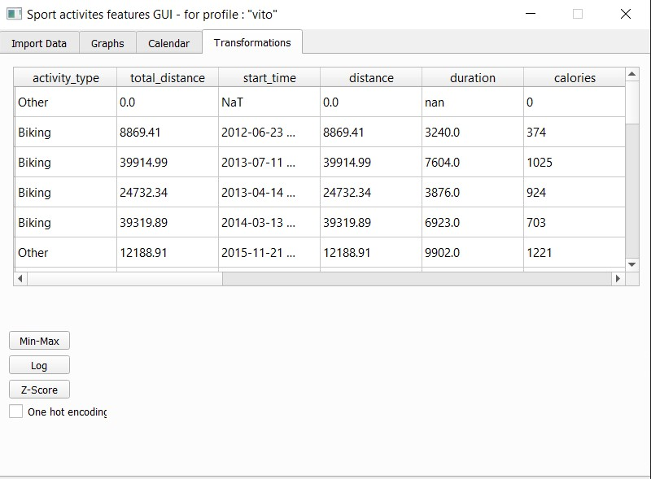

<p align="center">
  
</p>

<h1 align="center">
  sport-activities-features-gui
</h1>

<p align="center">
  <a href="https://pypi.python.org/pypi/sport-activities-features-gui">
    
  </a>
  
  
  <a href="https://pepy.tech/project/sport-activities-features-gui">
    
  </a>
  
</p>

<p align="center">
  
  <a href="https://github.com/firefly-cpp/sport-activities-features-gui/blob/master/LICENSE">
    
  </a>
  
  <a href='http://isitmaintained.com/project/firefly-cpp/sport-activities-features-gui "Average time to resolve an issue"'>
    
  </a>
  <a href='http://isitmaintained.com/project/firefly-cpp/sport-activities-features-gui "Percentage of issues still open"'>
    
  </a>
</p>

<p align="center">
  <a href="#-key-features">✨ Key features</a> •
  <a href="#-installation">📦 Installation</a> •
  <a href="#-screenshots">📸 Screenshots</a> •
  <a href="#-development">👩‍💻 Development</a> •
  <a href="#-license">🔑 License</a>
</p>

A simple GUI application that uses the library sports-activities-features to import sports activity files (TCX) and makes it easy to view and transform the data in a GUI environment. 🖥️🔄

## ✨ Key features
- Improved bulk importing of tcx files 📁
- Exporting data to different formats 💾
- Data transformations 🔄
- Calendar view of active days 📅
- Individual user profiles 👤

## 📦 Installation
### pip
To install `sport-activities-features-gui` using pip, run the following command:

```sh
pip install sport-activities-features-gui
```

## 📸 Screenshots
<p align="center">
  
  
  
  
  
</p>

## 👩‍💻 Development
### Prerequisites
  - [Python 3.10](https://www.python.org/downloads/)
  - [Poetry](https://python-poetry.org/docs/#installation)

### Installation
<ol>
  <li>
    Clone <a href="https://github.com/firefly-cpp/sport-activities-features-gui">this</a> repository from GitHub.
  </li>
  <li>
    Create a virtual environment and install the dependencies using poetry:
    <pre><code>poetry install</code></pre>
  </li>
  <li>
    Run the <code>main.py</code> file
    <table>
      <tr>
        <td>Script path</td>
        <td><code>&ltproject_folder&gt/sport-activities-features-gui/main.py</code></td>
      </tr>
      <tr>
        <td>Working directory</td>
        <td><code>&ltproject_folder&gt/sport-activities-features-gui/</code></td>
      </tr>
    </table>
  </li>
</ol>


## 🔑 License
This package is distributed under the MIT License. This license can be found online at <http://www.opensource.org/licenses/MIT>.

## Disclaimer

This framework is provided as-is, and there are no guarantees that it fits your purposes or that it is bug-free. Use it at your own risk!
